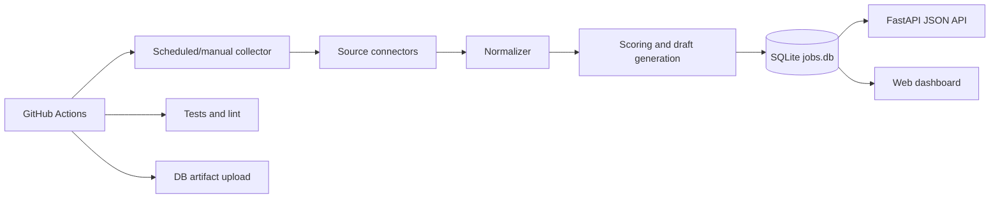

# Global Job Aggregator MVP

Safety-first MVP for collecting global job opportunities from official APIs, public JSON feeds, and ATS job-board APIs. The first version is optimized for AI automation, RAG, OpenAI/Claude API, workflow automation, scraping-analysis, LLM evaluation, and remote/high-value roles.

## What this MVP does

- Collects jobs from API-first sources into SQLite.
- Avoids login scraping and browser automation for platforms that prohibit it.
- Normalizes different job schemas into one table.
- Scores AI relevance and personal fit.
- Creates a first-pass proposal draft for each job.
- Exposes a FastAPI JSON API and a simple browser dashboard.
- Runs tests and linting on GitHub Actions.
- Can run scheduled collection and upload `jobs.db` as an Actions artifact.

## Source strategy

### Enabled without API keys

- Himalayas public Remote Jobs API
- Jobicy public API
- Remotive public API with conservative cooldown
- Arbeitnow public Job Board API
- Greenhouse Job Board API for configured company board tokens
- Lever Postings API for configured company slugs
- Ashby public Job Postings API for configured board names

### Enabled when keys are provided

- SerpApi Google Jobs via `SERPAPI_API_KEY`
- Freelancer.com API via `FREELANCER_OAUTH_TOKEN`

### Excluded from automatic collection for safety

- Upwork page scraping, LinkedIn page scraping, and logged-in browser automation are intentionally not implemented. Upwork can be tracked manually or through approved API access only.

## Quick start

```bash
python -m venv .venv
source .venv/bin/activate
pip install -r requirements.txt
cp .env.example .env
python scripts/collect_once.py --force
uvicorn app.main:app --reload
```

Open `http://127.0.0.1:8000`.

## API endpoints

- `GET /health`
- `GET /api/jobs?q=rag&source=himalayas&limit=50`
- `GET /api/jobs/{id}`
- `POST /api/collect`

## Key configuration

Environment variables are documented in `.env.example` and `docs/setup.md`.

Most important variables:

- `JOB_KEYWORDS`: comma-separated target keywords.
- `GREENHOUSE_BOARDS`: comma-separated Greenhouse board tokens.
- `LEVER_COMPANIES`: comma-separated Lever company slugs.
- `ASHBY_BOARDS`: comma-separated Ashby job-board names.
- `SERPAPI_API_KEY`: optional Google Jobs coverage.
- `FREELANCER_OAUTH_TOKEN`: optional Freelancer.com API access.
- `CONTACT_EMAIL`: contact address included in the user agent.

## Architecture

See `docs/architecture.md`.



## Testing

```bash
ruff check .
pytest -q
```

## GitHub Actions

- `.github/workflows/ci.yml`: lint and tests on push, pull request, and manual run.
- `.github/workflows/collect.yml`: manual/scheduled collection and SQLite artifact upload.

## Safety principles

1. Use official APIs or public JSON feeds first.
2. Do not automate logged-in sessions unless the platform explicitly approves it.
3. Respect source-specific rate limits and cooldowns.
4. Store source attribution and original URLs.
5. Keep application submission human-reviewed.

## Next roadmap

- Add user accounts and saved searches.
- Add Slack/LINE/email alerts for A-priority jobs.
- Add OpenAI/Claude-based semantic scoring with user profile input.
- Add CSV/XLSX export.
- Add employer/company intelligence enrichment.
- Add a proper deployment workflow once the hosting target is selected.
