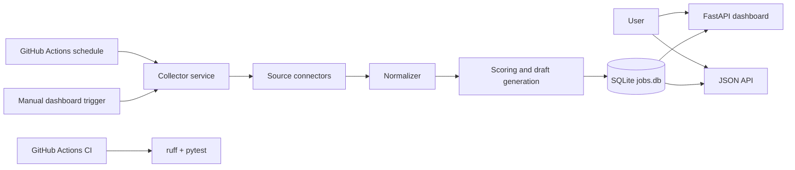

# Architecture and Requirements

## Product vision

Build a global job aggregation service that collects high-value AI, automation, RAG, API integration, data extraction, LLM evaluation, and remote contract opportunities while avoiding account bans and reducing load on third-party services.

## MVP scope

In scope:

- API-first collection from official/public feeds.
- SQLite storage.
- Web dashboard for search, filtering, priority review, and detail pages.
- JSON API for downstream automation.
- AI relevance scoring based on deterministic keyword rules.
- First-pass proposal draft generation.
- Conservative source cooldowns.
- GitHub Actions CI and scheduled collection.

Out of scope for MVP:

- Upwork/LinkedIn logged-in scraping.
- Automated proposal submission.
- Browser automation designed to bypass anti-bot protections.
- Paid production deployment.
- User authentication.

## Architecture

## Main data columns

- fetched_at
- source
- title
- company
- url
- compensation
- contract_type
- remote
- japan_ok
- required_skills
- ai_relevance
- fit_score
- expected_monthly_income
- application_priority
- proposal_draft
- status

## Source policy

Allowed by default:

- Himalayas Remote Jobs API
- Jobicy Remote Jobs API
- Remotive Remote Jobs API
- Arbeitnow Job Board API
- Greenhouse Job Board API
- Lever Postings API
- Ashby Job Postings API

Keyed/approved only:

- SerpApi Google Jobs requires `SERPAPI_API_KEY`.
- Freelancer.com requires `FREELANCER_OAUTH_TOKEN`.
- Upwork must be handled through approved API access or manual saved-search review.

Not implemented intentionally:

- Logged-in browser scraping.
- CAPTCHA bypass.
- High-frequency polling.
- Automated application/proposal submission.
- Collection from websites whose terms prohibit scraping without written permission.

## Secrets

Optional GitHub Secrets:

- `SERPAPI_API_KEY`
- `FREELANCER_OAUTH_TOKEN`

Optional GitHub repository variables:

- `GREENHOUSE_BOARDS`
- `LEVER_COMPANIES`
- `ASHBY_BOARDS`
- `CONTACT_EMAIL`
